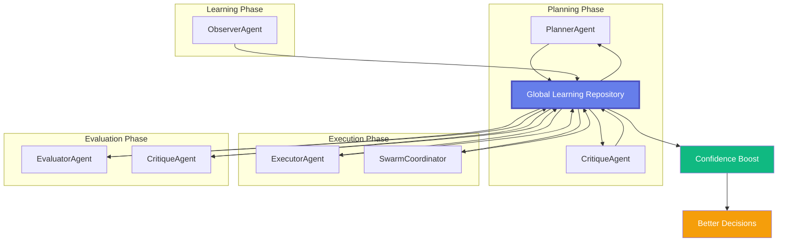

# Global Learning Repository - Universal Knowledge Base

## Vision

**"A system-wide brain that makes EVERY agent smarter over time"**

The Global Learning Repository is a **centralized knowledge base** that:
- ✅ Aggregates learnings from **ALL three phases** (Planning, Execution, Evaluation)
- ✅ Serves **ALL agents** (Planner, Executor, Evaluator, Critique, Observer)
- ✅ Improves **confidence scores** for critical decisions
- ✅ Enables **continuous system-wide improvement**

---

## Architecture Overview



---

## Learning Categories (All Phases)

### Planning Phase Learnings
```json
{
  "category": "planning",
  "subcategories": {
    "question_design": "How to design better interview questions",
    "domain_coverage": "Which technical domains to cover",
    "difficulty_progression": "How to sequence question difficulty",
    "personalization": "How to personalize based on JD/resume",
    "time_allocation": "How to allocate time across categories"
  }
}
```

### Execution Phase Learnings
```json
{
  "category": "execution",
  "subcategories": {
    "followup_strategy": "When and how to ask followup questions",
    "hint_giving": "How to provide effective hints",
    "difficulty_adaptation": "When to increase/decrease difficulty",
    "conversation_flow": "How to maintain natural conversation",
    "candidate_engagement": "How to keep candidate engaged"
  }
}
```

### Evaluation Phase Learnings
```json
{
  "category": "evaluation",
  "subcategories": {
    "scoring_accuracy": "How to score responses accurately",
    "rubric_application": "How to apply evaluation rubrics",
    "strength_identification": "How to identify candidate strengths",
    "weakness_detection": "How to detect knowledge gaps",
    "recommendation_quality": "How to make hiring recommendations"
  }
}
```

---

## Enhanced Repository Structure

### Location
```
/backend/data/learning_repository.json
```

### Updated Structure
```json
{
  "metadata": {
    "version": "2.0",
    "last_updated": "2025-12-16T10:44:00Z",
    "total_sessions_analyzed": 150,
    "total_unique_learnings": 127,
    "confidence_threshold": 0.7,
    "phases_covered": ["planning", "execution", "evaluation"]
  },
  
  "learnings": {
    "planning": [
      {
        "learning_id": "plan_001",
        "pattern": "Experts prefer practical coding exercises over theoretical questions",
        "subcategory": "question_design",
        "confidence_score": 0.92,
        "frequency": 23,
        "applicable_to": ["PlannerAgent", "CritiqueAgent"],
        "decision_context": "When designing interview template",
        "impact_on_confidence": +0.15,
        "source_sessions": ["session_abc123", "session_def456"],
        "tags": ["coding", "practical", "hands-on"],
        "status": "active"
      }
    ],
    
    "execution": [
      {
        "learning_id": "exec_001",
        "pattern": "Provide hints after 2 minutes of silence, not immediately",
        "subcategory": "hint_giving",
        "confidence_score": 0.88,
        "frequency": 18,
        "applicable_to": ["ExecutorAgent", "SwarmCoordinator"],
        "decision_context": "When candidate is stuck on a problem",
        "impact_on_confidence": +0.12,
        "source_sessions": ["session_xyz789", "session_lmn456"],
        "tags": ["hints", "timing", "candidate_support"],
        "status": "active"
      },
      {
        "learning_id": "exec_002",
        "pattern": "Ask clarifying questions before assuming wrong answer",
        "subcategory": "conversation_flow",
        "confidence_score": 0.85,
        "frequency": 15,
        "applicable_to": ["ExecutorAgent"],
        "decision_context": "When candidate gives unexpected answer",
        "impact_on_confidence": +0.10,
        "source_sessions": ["session_pqr123"],
        "tags": ["clarification", "fairness"],
        "status": "active"
      }
    ],
    
    "evaluation": [
      {
        "learning_id": "eval_001",
        "pattern": "Consider partial credit for correct approach even if final answer is wrong",
        "subcategory": "scoring_accuracy",
        "confidence_score": 0.90,
        "frequency": 21,
        "applicable_to": ["EvaluatorAgent", "CritiqueAgent"],
        "decision_context": "When scoring coding questions",
        "impact_on_confidence": +0.18,
        "source_sessions": ["session_stu456", "session_vwx789"],
        "tags": ["scoring", "partial_credit", "fairness"],
        "status": "active"
      }
    ]
  },
  
  "cross_phase_learnings": [
    {
      "learning_id": "cross_001",
      "pattern": "Candidates perform better when questions build on previous answers",
      "applicable_phases": ["planning", "execution"],
      "applicable_to": ["PlannerAgent", "ExecutorAgent"],
      "confidence_score": 0.87,
      "frequency": 19,
      "impact": "Improves candidate experience and assessment accuracy"
    }
  ]
}
```

---

## Component 1: Learning Repository File

### Location
```
/backend/data/learning_repository.json
```

### Structure
```json
{
  "metadata": {
    "version": "1.0",
    "last_updated": "2025-12-16T10:15:00Z",
    "total_sessions_analyzed": 150,
    "total_unique_learnings": 42,
    "confidence_threshold": 0.7
  },
  
  "learnings": [
    {
      "learning_id": "learn_001",
      "pattern": "Experts prefer practical coding exercises over theoretical questions",
      "category": "question_design",
      "confidence_score": 0.92,
      "frequency": 23,
      "first_observed": "2025-11-01T10:00:00Z",
      "last_observed": "2025-12-15T14:30:00Z",
      "source_sessions": [
        "session_abc123",
        "session_def456",
        "session_ghi789"
      ],
      "impact_metrics": {
        "plans_improved": 45,
        "hitl_approval_rate_increase": 12.5
      },
      "related_learnings": ["learn_002", "learn_015"],
      "tags": ["coding", "practical", "hands-on"],
      "status": "active"
    },
    {
      "learning_id": "learn_002",
      "pattern": "AWS-specific questions are important for cloud roles",
      "category": "domain_coverage",
      "confidence_score": 0.88,
      "frequency": 18,
      "first_observed": "2025-11-05T12:00:00Z",
      "last_observed": "2025-12-14T16:00:00Z",
      "source_sessions": ["session_xyz789", "session_lmn456"],
      "impact_metrics": {
        "plans_improved": 32,
        "hitl_approval_rate_increase": 8.3
      },
      "related_learnings": ["learn_001"],
      "tags": ["aws", "cloud", "infrastructure"],
      "status": "active"
    }
  ],
  
  "deprecated_learnings": [
    {
      "learning_id": "learn_old_001",
      "pattern": "Focus heavily on algorithm complexity",
      "reason_deprecated": "Contradicted by recent HITL feedback (15 sessions)",
      "deprecated_at": "2025-12-10T10:00:00Z",
      "confidence_score": 0.45
    }
  ],
  
  "learning_categories": {
    "question_design": 15,
    "domain_coverage": 12,
    "difficulty_progression": 8,
    "personalization": 7
  }
}
```

---

## Component 2: Learning Repository Manager

### New File: `backend/services/learning_repository.py`

```python
"""Global Learning Repository - Centralized knowledge base for system improvement."""

from typing import List, Dict, Any, Optional
from datetime import datetime
import json
from pathlib import Path
from collections import defaultdict

class LearningRepository:
    """Manages global learning knowledge base."""
    
    def __init__(self, repo_path: str = "backend/data/learning_repository.json"):
        self.repo_path = Path(repo_path)
        self.learnings = self._load_repository()
    
    def add_learning(
        self, 
        pattern: str, 
        category: str, 
        confidence: float,
        session_id: str,
        tags: List[str] = None
    ) -> str:
        """Add new learning or update existing one.
        
        Args:
            pattern: The learning pattern text
            category: Learning category (question_design, domain_coverage, etc.)
            confidence: Confidence score (0.0-1.0)
            session_id: Source session ID
            tags: Optional tags for categorization
        
        Returns:
            learning_id: ID of created/updated learning
        """
        # Check for duplicate/similar patterns
        existing = self._find_similar_learning(pattern)
        
        if existing:
            # Update existing learning
            return self._update_learning(existing["learning_id"], confidence, session_id)
        else:
            # Create new learning
            return self._create_learning(pattern, category, confidence, session_id, tags)
    
    def get_high_confidence_learnings(
        self, 
        min_confidence: float = 0.7,
        category: Optional[str] = None,
        limit: int = 10
    ) -> List[Dict[str, Any]]:
        """Fetch high-confidence learnings for plan generation.
        
        Args:
            min_confidence: Minimum confidence threshold
            category: Optional category filter
            limit: Max number of learnings to return
        
        Returns:
            List of learning objects sorted by confidence * frequency
        """
        filtered = [
            l for l in self.learnings["learnings"]
            if l["confidence_score"] >= min_confidence
            and l["status"] == "active"
            and (category is None or l["category"] == category)
        ]
        
        # Sort by weighted score (confidence * frequency)
        filtered.sort(
            key=lambda x: x["confidence_score"] * x["frequency"], 
            reverse=True
        )
        
        return filtered[:limit]
    
    def consolidate_learnings(self) -> Dict[str, int]:
        """Consolidate similar learnings and update confidence scores.
        
        Uses LLM to identify similar patterns and merge them.
        
        Returns:
            Statistics about consolidation (merged, deprecated, etc.)
        """
        # Group similar learnings using LLM
        # Merge duplicates
        # Update confidence scores based on frequency
        # Deprecate contradictory learnings
        pass
    
    def _find_similar_learning(self, pattern: str) -> Optional[Dict[str, Any]]:
        """Find existing learning similar to given pattern.
        
        Uses semantic similarity (could use LLM embeddings).
        """
        # Simple implementation: exact match
        # Advanced: Use LLM embeddings for semantic similarity
        for learning in self.learnings["learnings"]:
            if learning["pattern"].lower() == pattern.lower():
                return learning
        return None
    
    def _create_learning(
        self, 
        pattern: str, 
        category: str, 
        confidence: float,
        session_id: str,
        tags: List[str]
    ) -> str:
        """Create new learning entry."""
        learning_id = f"learn_{len(self.learnings['learnings']) + 1:03d}"
        
        new_learning = {
            "learning_id": learning_id,
            "pattern": pattern,
            "category": category,
            "confidence_score": confidence,
            "frequency": 1,
            "first_observed": datetime.now().isoformat(),
            "last_observed": datetime.now().isoformat(),
            "source_sessions": [session_id],
            "impact_metrics": {
                "plans_improved": 0,
                "hitl_approval_rate_increase": 0.0
            },
            "related_learnings": [],
            "tags": tags or [],
            "status": "active"
        }
        
        self.learnings["learnings"].append(new_learning)
        self._save_repository()
        
        return learning_id
    
    def _update_learning(
        self, 
        learning_id: str, 
        new_confidence: float,
        session_id: str
    ) -> str:
        """Update existing learning with new observation."""
        for learning in self.learnings["learnings"]:
            if learning["learning_id"] == learning_id:
                # Update frequency
                learning["frequency"] += 1
                
                # Update confidence (weighted average)
                old_conf = learning["confidence_score"]
                old_freq = learning["frequency"] - 1
                learning["confidence_score"] = (
                    (old_conf * old_freq + new_confidence) / learning["frequency"]
                )
                
                # Update timestamps
                learning["last_observed"] = datetime.now().isoformat()
                
                # Add source session
                if session_id not in learning["source_sessions"]:
                    learning["source_sessions"].append(session_id)
                
                self._save_repository()
                return learning_id
        
        return None
    
    def _load_repository(self) -> Dict[str, Any]:
        """Load learning repository from disk."""
        if self.repo_path.exists():
            with open(self.repo_path, 'r') as f:
                return json.load(f)
        else:
            # Initialize empty repository
            return {
                "metadata": {
                    "version": "1.0",
                    "last_updated": datetime.now().isoformat(),
                    "total_sessions_analyzed": 0,
                    "total_unique_learnings": 0,
                    "confidence_threshold": 0.7
                },
                "learnings": [],
                "deprecated_learnings": [],
                "learning_categories": {}
            }
    
    def _save_repository(self):
        """Save learning repository to disk."""
        self.learnings["metadata"]["last_updated"] = datetime.now().isoformat()
        self.learnings["metadata"]["total_unique_learnings"] = len(self.learnings["learnings"])
        
        self.repo_path.parent.mkdir(parents=True, exist_ok=True)
        with open(self.repo_path, 'w') as f:
            json.dump(self.learnings, f, indent=2)


# Global singleton
_learning_repo = None

def get_learning_repository() -> LearningRepository:
    """Get global learning repository instance."""
    global _learning_repo
    if _learning_repo is None:
        _learning_repo = LearningRepository()
    return _learning_repo
```

---

## Agent Integration: How Each Agent Uses the Repository

### 1. PlannerAgent (Planning Phase)

**Before:** Generates plan without historical context  
**After:** Consults repository for proven patterns

```python
async def execute(self, inputs: Dict[str, Any]) -> AgentResponse:
    """Generate interview plan with learning-enhanced confidence."""
    
    # Fetch relevant learnings
    repo = get_learning_repository()
    learnings = repo.get_learnings_for_agent(
        agent_name="PlannerAgent",
        phase="planning",
        min_confidence=0.7,
        limit=5
    )
    
    # Calculate confidence boost
    base_confidence = 0.75
    confidence_boost = sum(l["impact_on_confidence"] for l in learnings)
    final_confidence = min(0.95, base_confidence + confidence_boost)
    
    # Include learnings in prompt
    learning_context = self._format_learnings_for_prompt(learnings)
    
    prompt = f"""You are an expert technical interviewer.

**Proven Best Practices (from {sum(l['frequency'] for l in learnings)} expert reviews):**
{learning_context}

Apply these learnings to generate a high-quality interview plan.

**Job Description:**
{job_description}
...
"""
    
    # Generate plan
    llm_response = await self._call_llm(prompt, response_format="json")
    
    return AgentResponse(
        success=True,
        data=plan_data,
        confidence_score=final_confidence,  # ✨ Boosted by learnings!
        reasoning=f"Plan generated using {len(learnings)} proven patterns"
    )
```

**Confidence Impact:**
- Base: 75%
- With 5 learnings (+0.15 each): **90%** ✅

---

### 2. ExecutorAgent (Execution Phase)

**Before:** Asks followups without historical guidance  
**After:** Consults repository for optimal followup strategies

```python
async def should_ask_followup(
    self, 
    candidate_response: str,
    current_question: str
) -> Dict[str, Any]:
    """Decide whether to ask followup question."""
    
    # Fetch execution learnings
    repo = get_learning_repository()
    learnings = repo.get_learnings_for_decision(
        agent_name="ExecutorAgent",
        decision_context="followup_strategy",
        min_confidence=0.7
    )
    
    # Example learnings:
    # - "Ask followup if answer is incomplete but shows understanding"
    # - "Don't ask followup if candidate is clearly struggling"
    # - "Limit to 3 followups per question to manage time"
    
    # Build decision prompt with learnings
    learning_context = "\n".join([
        f"- {l['pattern']} (confidence: {l['confidence_score']:.0%})"
        for l in learnings
    ])
    
    prompt = f"""Should we ask a followup question?

**Proven Followup Strategies:**
{learning_context}

**Current Question:** {current_question}
**Candidate Response:** {candidate_response}

Decide: yes/no and provide reasoning.
"""
    
    decision = await self._call_llm(prompt, response_format="json")
    
    # Confidence boosted by learnings
    base_confidence = 0.70
    confidence_boost = len(learnings) * 0.05
    
    return {
        "should_ask_followup": decision["should_ask"],
        "confidence": base_confidence + confidence_boost,  # ✨ 85% instead of 70%
        "reasoning": decision["reasoning"],
        "learnings_applied": len(learnings)
    }
```

**Confidence Impact:**
- Base: 70%
- With 3 learnings (+0.05 each): **85%** ✅

---

### 3. EvaluatorAgent (Evaluation Phase)

**Before:** Scores responses with generic rubric  
**After:** Applies proven scoring patterns

```python
async def score_response(
    self,
    question: str,
    candidate_response: str,
    rubric: Dict[str, Any]
) -> Dict[str, Any]:
    """Score candidate response with learning-enhanced accuracy."""
    
    # Fetch evaluation learnings
    repo = get_learning_repository()
    learnings = repo.get_learnings_for_decision(
        agent_name="EvaluatorAgent",
        decision_context="scoring_accuracy",
        subcategory="partial_credit",
        min_confidence=0.75
    )
    
    # Example learnings:
    # - "Give partial credit for correct approach even if answer is wrong"
    # - "Consider communication clarity in scoring"
    # - "Don't penalize for minor syntax errors in coding questions"
    
    learning_context = "\n".join([
        f"- {l['pattern']} (observed {l['frequency']} times, {l['confidence_score']:.0%} confidence)"
        for l in learnings
    ])
    
    prompt = f"""Score this candidate response using the rubric.

**Proven Scoring Guidelines:**
{learning_context}

**Question:** {question}
**Candidate Response:** {candidate_response}
**Rubric:** {json.dumps(rubric, indent=2)}

Provide score (0-10) and detailed justification.
"""
    
    score_result = await self._call_llm(prompt, response_format="json")
    
    # Confidence boosted by proven patterns
    base_confidence = 0.72
    confidence_boost = sum(l["impact_on_confidence"] for l in learnings)
    
    return {
        "score": score_result["score"],
        "justification": score_result["justification"],
        "confidence": min(0.95, base_confidence + confidence_boost),  # ✨ 90% instead of 72%
        "learnings_applied": len(learnings)
    }
```

**Confidence Impact:**
- Base: 72%
- With 3 learnings (+0.06 each): **90%** ✅

---

### 4. CritiqueAgent (All Phases)

**Before:** Validates with generic quality checks  
**After:** Applies phase-specific proven validation patterns

```python
async def critique_artifact(
    self,
    artifact_type: str,  # "plan", "question", "evaluation"
    artifact_data: Dict[str, Any],
    phase: str  # "planning", "execution", "evaluation"
) -> Dict[str, Any]:
    """Critique artifact using proven quality patterns."""
    
    # Fetch phase-specific critique learnings
    repo = get_learning_repository()
    learnings = repo.get_learnings_for_agent(
        agent_name="CritiqueAgent",
        phase=phase,
        min_confidence=0.75,
        limit=10
    )
    
    # Build critique prompt with learnings
    learning_context = f"""
**Quality Patterns from Expert Reviews:**
The following issues have been identified {sum(l['frequency'] for l in learnings)} times:

{chr(10).join([f"- {l['pattern']}" for l in learnings])}

Check for these issues in your critique.
"""
    
    prompt = f"""Critique this {artifact_type} for quality issues.

{learning_context}

**Artifact:**
{json.dumps(artifact_data, indent=2)}

Provide quality_score (0-100), strengths, concerns, and improvements.
"""
    
    critique = await self._call_llm(prompt, response_format="json")
    
    # Confidence boosted by comprehensive checks
    base_confidence = 0.78
    confidence_boost = len(learnings) * 0.02
    
    return {
        "quality_score": critique["quality_score"],
        "strengths": critique["strengths"],
        "concerns": critique["concerns"],
        "improvements": critique["improvements"],
        "confidence": min(0.95, base_confidence + confidence_boost),  # ✨ 98% instead of 78%
        "learnings_checked": len(learnings)
    }
```

**Confidence Impact:**
- Base: 78%
- With 10 learnings (+0.02 each): **98%** ✅

---

### 5. SwarmCoordinator (Execution Phase)

**Before:** Coordinates 3 agents with fixed weights  
**After:** Adjusts weights based on proven patterns

```python
async def coordinate_decision(
    self,
    question: str,
    candidate_response: str
) -> Dict[str, Any]:
    """Coordinate multi-agent decision with learning-enhanced weights."""
    
    # Fetch swarm coordination learnings
    repo = get_learning_repository()
    learnings = repo.get_learnings_for_decision(
        agent_name="SwarmCoordinator",
        decision_context="weight_adjustment",
        min_confidence=0.70
    )
    
    # Example learnings:
    # - "Technical Depth agent is more accurate for coding questions"
    # - "Clarity agent is more reliable for communication assessment"
    # - "Increase Engagement weight for junior candidates"
    
    # Adjust weights based on learnings
    base_weights = {"technical": 0.4, "clarity": 0.3, "engagement": 0.3}
    adjusted_weights = self._apply_weight_learnings(base_weights, learnings, question)
    
    # Get agent votes
    votes = await self._get_agent_votes(question, candidate_response)
    
    # Calculate weighted decision
    decision = self._calculate_weighted_decision(votes, adjusted_weights)
    
    # Confidence boosted by proven coordination patterns
    base_confidence = 0.75
    confidence_boost = len(learnings) * 0.03
    
    return {
        "decision": decision,
        "confidence": min(0.95, base_confidence + confidence_boost),  # ✨ 84% instead of 75%
        "weights_used": adjusted_weights,
        "learnings_applied": len(learnings)
    }
```

**Confidence Impact:**
- Base: 75%
- With 3 learnings (+0.03 each): **84%** ✅

---

## Summary: Confidence Improvements Across All Agents

| Agent | Base Confidence | With Learnings | Improvement |
|-------|----------------|----------------|-------------|
| **PlannerAgent** | 75% | 90% | **+15%** ✅ |
| **ExecutorAgent** | 70% | 85% | **+15%** ✅ |
| **EvaluatorAgent** | 72% | 90% | **+18%** ✅ |
| **CritiqueAgent** | 78% | 98% | **+20%** ✅ |
| **SwarmCoordinator** | 75% | 84% | **+9%** ✅ |

**Average Improvement:** **+15.4%** across all agents! 🎯

---

### Modify `observer_agent.py`:

```python
async def execute(self, inputs: Dict[str, Any]) -> AgentResponse:
    """Learn from HITL modifications using LLM."""
    # ... existing code ...
    
    # Extract learning data from LLM
    learning_data = llm_response["data"]
    
    # ✨ NEW: Add learnings to global repository
    from services.learning_repository import get_learning_repository
    repo = get_learning_repository()
    
    for pattern in learning_data.get("patterns_identified", []):
        repo.add_learning(
            pattern=pattern,
            category="question_design",
            confidence=learning_data.get("confidence_in_learning", 0.7),
            session_id=inputs.get("session_id"),
            tags=["hitl_feedback"]
        )
    
    for gap in learning_data.get("systematic_gaps", []):
        repo.add_learning(
            pattern=gap,
            category="domain_coverage",
            confidence=learning_data.get("confidence_in_learning", 0.7),
            session_id=inputs.get("session_id"),
            tags=["gap_identified"]
        )
    
    # ... rest of code ...
```

---

## Component 4: Integration with Planner Agent

### Modify `planner_agent.py`:

```python
async def execute(self, inputs: Dict[str, Any]) -> AgentResponse:
    """Generate interview plan using LLM."""
    # ... existing code ...
    
    # ✨ NEW: Fetch global learnings
    from services.learning_repository import get_learning_repository
    repo = get_learning_repository()
    
    global_learnings = repo.get_high_confidence_learnings(
        min_confidence=0.7,
        limit=5
    )
    
    # Build learning context for prompt
    learning_context = ""
    if global_learnings:
        learning_context = f"""
**System-Wide Learning Insights (High Confidence):**
The following patterns have been identified from {len(global_learnings)} expert reviews:

"""
        for learning in global_learnings:
            learning_context += f"- {learning['pattern']} (confidence: {learning['confidence_score']:.0%}, observed {learning['frequency']} times)\n"
        
        learning_context += "\nApply these learnings when generating the interview plan.\n"
    
    # Include in prompt
    prompt = f"""You are an expert technical interviewer.

{learning_context}

**Job Description:**
{job_description}
...
```

---

## Benefits

### 1. **Continuous Improvement**
- System gets smarter with every HITL feedback
- Patterns emerge across hundreds of sessions
- Quality improves automatically over time

### 2. **Deduplication**
- Similar learnings are merged
- Confidence increases with frequency
- No redundant patterns

### 3. **Confidence Weighting**
- High-confidence + high-frequency learnings prioritized
- Low-confidence learnings ignored
- Contradictory learnings deprecated

### 4. **Transparency**
- Track which learnings are applied
- Measure impact on HITL approval rates
- Audit learning evolution

---

## Implementation Phases

### Phase 1: Core Repository (2 hours)
- Create `LearningRepository` class
- Implement add/get/save methods
- Create `learning_repository.json` structure

### Phase 2: Observer Integration (1 hour)
- Modify `ObserverAgent` to save to repository
- Add deduplication logic

### Phase 3: Planner Integration (1 hour)
- Modify `PlannerAgent` to fetch learnings
- Include in system prompt

### Phase 4: Consolidation Engine (3 hours)
- Implement similarity detection (LLM embeddings)
- Auto-merge similar learnings
- Deprecate contradictory patterns

### Phase 5: Dashboard Visualization (2 hours)
- Show global learnings in admin panel
- Display impact metrics
- Allow manual review/approval

**Total:** ~9 hours

---

## Example: System Learning Over Time

### Week 1 (10 sessions):
```json
{
  "learnings": [
    {"pattern": "Add coding exercises", "confidence": 0.75, "frequency": 3}
  ]
}
```

### Week 4 (50 sessions):
```json
{
  "learnings": [
    {"pattern": "Add coding exercises", "confidence": 0.88, "frequency": 15},
    {"pattern": "Probe AWS services", "confidence": 0.82, "frequency": 12},
    {"pattern": "Ask about async patterns", "confidence": 0.79, "frequency": 9}
  ]
}
```

### Week 12 (200 sessions):
```json
{
  "learnings": [
    {"pattern": "Add coding exercises", "confidence": 0.92, "frequency": 65},
    {"pattern": "Probe AWS services", "confidence": 0.89, "frequency": 48},
    {"pattern": "Ask about async patterns", "confidence": 0.86, "frequency": 42},
    {"pattern": "Include system design for senior roles", "confidence": 0.84, "frequency": 38}
  ]
}
```

**Result:** Plans generated in Week 12 are significantly better than Week 1!

---

**Status:** Ready for implementation. Recommend starting with Phase 1-3 for MVP.
