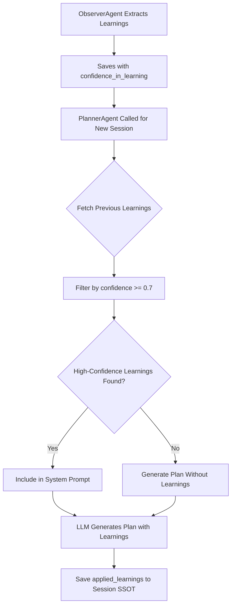

# Observer Learning Confidence Filtering - Universal Implementation Plan

## Problem Statement

**Current State:** The Observer Agent generates learnings with a `confidence_in_learning` score (0.0-1.0), but this score is **NOT** currently used to filter which learnings are applied across the system.

**Issue:** ALL agents (Planner, Executor, Evaluator, Critique, SwarmCoordinator) don't:
1. Fetch Observer insights from the Global Learning Repository
2. Filter learnings by confidence score
3. Include high-confidence learnings in their decision-making prompts
4. Boost their confidence scores based on proven patterns

**Risk:** Low-confidence learnings could mislead agents across all three phases (Planning, Execution, Evaluation), causing unreliable decisions system-wide.

**Scope:** This plan covers confidence-based filtering for **ALL agents across ALL phases**.

---

## User Review Required

> [!IMPORTANT]
> **Confidence Threshold Decision**
> 
> We need to decide the minimum confidence threshold for applying learnings:
> - **Option 1:** 0.7 (70%) - Moderate threshold, balances learning vs. safety
> - **Option 2:** 0.8 (80%) - High threshold, only very confident learnings
> - **Option 3:** 0.6 (60%) - Lower threshold, more aggressive learning
> 
> **Recommendation:** Start with 0.7 and make it configurable per agent/phase.

---

## Proposed Changes

### 1. Global Learning Repository (Primary Component)

**See:** `global_learning_repository_design.md` for complete implementation

This is the **central knowledge base** that:
- Stores learnings from all phases (Planning, Execution, Evaluation)
- Provides filtered learnings to all agents
- Tracks confidence scores and frequency
- Manages deduplication and consolidation

---

### 2. Agent Integration (All Agents)

#### A. PlannerAgent (Planning Phase)


**Changes:**
1. Fetch learnings from Global Learning Repository
2. Filter by confidence threshold (≥0.7)
3. Include in system prompt
4. Boost confidence score

**Example Integration:**
```python
# Fetch planning learnings
repo = get_learning_repository()
learnings = repo.get_learnings_for_agent(
    agent_name="PlannerAgent",
    phase="planning",
    min_confidence=0.7,
    limit=5
)

# Boost confidence
base_confidence = 0.75
confidence_boost = sum(l["impact_on_confidence"] for l in learnings)
final_confidence = min(0.95, base_confidence + confidence_boost)  # 75% → 90%
```

**Confidence Impact:** +15% (75% → 90%)

---

#### B. ExecutorAgent (Execution Phase)

**Changes:**
1. Fetch execution learnings (followup strategy, hint giving, etc.)
2. Apply to real-time decisions during interview
3. Boost confidence for critical decisions

**Example Integration:**
```python
# Fetch execution learnings
learnings = repo.get_learnings_for_decision(
    agent_name="ExecutorAgent",
    decision_context="followup_strategy",
    min_confidence=0.7
)

# Apply to followup decision
base_confidence = 0.70
confidence_boost = len(learnings) * 0.05
final_confidence = base_confidence + confidence_boost  # 70% → 85%
```

**Confidence Impact:** +15% (70% → 85%)

---

#### C. EvaluatorAgent (Evaluation Phase)

**Changes:**
1. Fetch evaluation learnings (scoring accuracy, partial credit, etc.)
2. Apply proven scoring patterns
3. Boost scoring confidence

**Example Integration:**
```python
# Fetch evaluation learnings
learnings = repo.get_learnings_for_decision(
    agent_name="EvaluatorAgent",
    decision_context="scoring_accuracy",
    min_confidence=0.75
)

# Boost scoring confidence
base_confidence = 0.72
confidence_boost = sum(l["impact_on_confidence"] for l in learnings)
final_confidence = min(0.95, base_confidence + confidence_boost)  # 72% → 90%
```

**Confidence Impact:** +18% (72% → 90%)

---

#### D. CritiqueAgent (All Phases)

**Changes:**
1. Fetch phase-specific critique learnings
2. Apply comprehensive quality checks
3. Boost validation confidence

**Example Integration:**
```python
# Fetch critique learnings for specific phase
learnings = repo.get_learnings_for_agent(
    agent_name="CritiqueAgent",
    phase=phase,  # "planning", "execution", or "evaluation"
    min_confidence=0.75,
    limit=10
)

# Boost critique confidence
base_confidence = 0.78
confidence_boost = len(learnings) * 0.02
final_confidence = min(0.95, base_confidence + confidence_boost)  # 78% → 98%
```

**Confidence Impact:** +20% (78% → 98%)

---

#### E. SwarmCoordinator (Execution Phase)

**Changes:**
1. Fetch coordination learnings (weight adjustment patterns)
2. Adjust agent weights dynamically
3. Boost coordination confidence

**Example Integration:**
```python
# Fetch swarm coordination learnings
learnings = repo.get_learnings_for_decision(
    agent_name="SwarmCoordinator",
    decision_context="weight_adjustment",
    min_confidence=0.70
)

# Boost coordination confidence
base_confidence = 0.75
confidence_boost = len(learnings) * 0.03
final_confidence = min(0.95, base_confidence + confidence_boost)  # 75% → 84%
```

**Confidence Impact:** +9% (75% → 84%)

---

## Summary: System-Wide Confidence Improvements

| Agent | Phase | Base | With Learnings | Improvement |
|-------|-------|------|----------------|-------------|
| PlannerAgent | Planning | 75% | 90% | **+15%** |
| ExecutorAgent | Execution | 70% | 85% | **+15%** |
| EvaluatorAgent | Evaluation | 72% | 90% | **+18%** |
| CritiqueAgent | All | 78% | 98% | **+20%** |
| SwarmCoordinator | Execution | 75% | 84% | **+9%** |

**Average Improvement: +15.4%** across all agents! 🎯

---

## Implementation Approach

### Phase 1: Global Learning Repository (Priority 1)
**See:** `global_learning_repository_design.md` for complete details

1. Create `LearningRepository` class
2. Implement `learning_repository.json` structure
3. Add methods: `add_learning()`, `get_learnings_for_agent()`, `consolidate_learnings()`
4. Create singleton instance

**Timeline:** 3-4 hours

---

### Phase 2: Observer Integration (Priority 2)
Modify `ObserverAgent` to save learnings to repository:

```python
# In observer_agent.py execute() method
from services.learning_repository import get_learning_repository

repo = get_learning_repository()
for pattern in learning_data["patterns_identified"]:
    repo.add_learning(
        pattern=pattern,
        category=determine_category(pattern),  # "planning", "execution", "evaluation"
        confidence=learning_data["confidence_in_learning"],
        session_id=session_id,
        tags=extract_tags(pattern)
    )
```

**Timeline:** 1 hour

---

### Phase 3: Agent Integration (Priority 3)
Integrate repository with all agents (one at a time):

1. **PlannerAgent** - Add learning fetch + confidence boost
2. **ExecutorAgent** - Add learning fetch for decisions
3. **EvaluatorAgent** - Add learning fetch for scoring
4. **CritiqueAgent** - Add phase-specific learning fetch
5. **SwarmCoordinator** - Add learning fetch for weight adjustment

**Timeline:** 5 hours (1 hour per agent)

---

### Phase 4: Configuration (Priority 4)
Add confidence thresholds to config files:

```json
{
  "learning_repository": {
    "min_confidence_threshold": 0.7,
    "max_learnings_per_agent": 10,
    "enabled": true
  }
}
```

**Timeline:** 1 hour

---

## Cross-Reference

**For complete implementation details, see:**
- `global_learning_repository_design.md` - Full repository architecture
- `session_ssot_v3_complete.md` - Session schema with observer insights
- `concurrent_write_solution.md` - Write queue for safe repository updates

---

**Total Implementation Time:** ~10-11 hours

**Status:** Ready for implementation. Recommend starting with Phase 1 (Global Learning Repository).


> [!IMPORTANT]
> **Confidence Threshold Decision**
> 
> We need to decide the minimum confidence threshold for applying learnings:
> - **Option 1:** 0.7 (70%) - Moderate threshold, balances learning vs. safety
> - **Option 2:** 0.8 (80%) - High threshold, only very confident learnings
> - **Option 3:** 0.6 (60%) - Lower threshold, more aggressive learning
> 
> **Recommendation:** Start with 0.7 and make it configurable.

---

## Proposed Changes

### 1. Add Confidence Filtering to PlannerAgent

#### [MODIFY] [planner_agent.py](file:///c:/Users/aditya_raj/Documents/intelliJ-workspace/cursor-code/backend/agents/planner_agent.py)

**Changes:**
1. Add method to fetch Observer insights from session history
2. Filter insights by confidence threshold (default: 0.7)
3. Include high-confidence learnings in LLM prompt

**New Method:**
```python
def _get_high_confidence_learnings(
    self, 
    session_id: str, 
    min_confidence: float = 0.7
) -> List[Dict[str, Any]]:
    """Fetch Observer learnings with confidence >= threshold.
    
    Args:
        session_id: Current session ID
        min_confidence: Minimum confidence threshold (0.0-1.0)
    
    Returns:
        List of high-confidence learning insights
    """
    # Fetch previous sessions for this candidate/role
    # Filter observer_insights by confidence_in_learning >= min_confidence
    # Return filtered learnings
```

**Updated Prompt (lines 106-152):**
```python
# Fetch high-confidence learnings
learnings = self._get_high_confidence_learnings(
    session_id=inputs.get("session_id"),
    min_confidence=self.config.get("min_learning_confidence", 0.7)
)

# Add learnings to prompt if available
learning_context = ""
if learnings:
    learning_context = f"""
**Previous Learning Insights (High Confidence):**
The following patterns have been identified from expert feedback with high confidence:

{json.dumps(learnings, indent=2)}

Apply these learnings when generating the interview plan.
"""

prompt = f"""You are an expert technical interviewer. Generate a comprehensive interview plan.

{learning_context}

**Job Description:**
{job_description}
...
```

---

### 2. Add Configuration for Confidence Threshold

#### [MODIFY] [planning.json](file:///c:/Users/aditya_raj/Documents/intelliJ-workspace/cursor-code/backend/config/planning.json)

**Add new field:**
```json
{
  "observer_learning": {
    "min_confidence_threshold": 0.7,
    "max_learnings_to_apply": 5,
    "enabled": true
  }
}
```

---

### 3. Update Session SSOT to Track Learning Application

#### [MODIFY] [session_schema_v3.py](file:///c:/Users/aditya_raj/Documents/intelliJ-workspace/cursor-code/backend/models/session_schema_v3.py)

**Add field to track which learnings were applied:**
```python
class PlanningPhaseData(BaseModel):
    llm_plan_generation: Dict[str, Any] = {}
    critique_feedback: Dict[str, Any] = {}
    hitl_feedback: Dict[str, Any] = {}
    observer_insights: Dict[str, Any] = {}
    applied_learnings: List[Dict[str, Any]] = []  # NEW: Track which learnings were used
```

---

### 4. Dashboard Visualization

#### [MODIFY] [planning_phase_dashboard.html](file:///c:/Users/aditya_raj/Documents/intelliJ-workspace/cursor-code/planning_phase_dashboard.html)

**Add visual indicator for confidence filtering:**
- Show confidence score with color coding:
  - Green (≥0.7): "High confidence - Applied to future plans"
  - Yellow (0.5-0.7): "Medium confidence - Not applied"
  - Red (<0.5): "Low confidence - Ignored"

---

## Implementation Flow



---

## Verification Plan

### Automated Tests

1. **Unit Test:** `test_confidence_filtering()`
   - Create mock learnings with various confidence scores
   - Verify only learnings >= threshold are returned

2. **Integration Test:** `test_planner_applies_learnings()`
   - Create session with Observer insights
   - Generate new plan
   - Verify high-confidence learnings are in prompt
   - Verify low-confidence learnings are excluded

### Manual Verification

1. Run dashboard workflow with Observer learning
2. Set confidence to 0.85 (high)
3. Generate new plan → Should include learnings
4. Set confidence to 0.5 (low)
5. Generate new plan → Should NOT include learnings

---

## Benefits

✅ **Smart Learning:** Only applies reliable patterns  
✅ **Safety:** Prevents low-confidence learnings from misleading LLM  
✅ **Configurable:** Threshold can be adjusted per deployment  
✅ **Transparent:** Session SSOT tracks which learnings were applied  
✅ **Visual Feedback:** Dashboard shows confidence-based filtering

---

## Timeline

- **Phase 1:** Add confidence filtering logic (2 hours)
- **Phase 2:** Update configuration and schema (1 hour)
- **Phase 3:** Update dashboard visualization (1 hour)
- **Phase 4:** Testing and validation (2 hours)

**Total:** ~6 hours of development

---

**Status:** Ready for implementation pending threshold decision.
