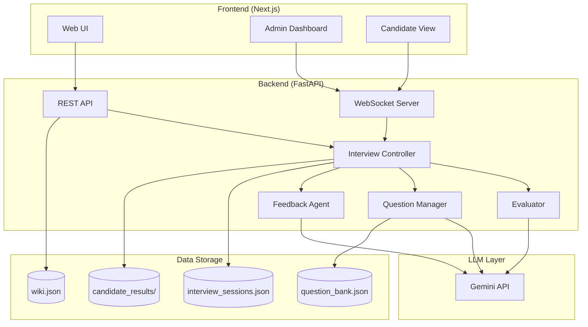
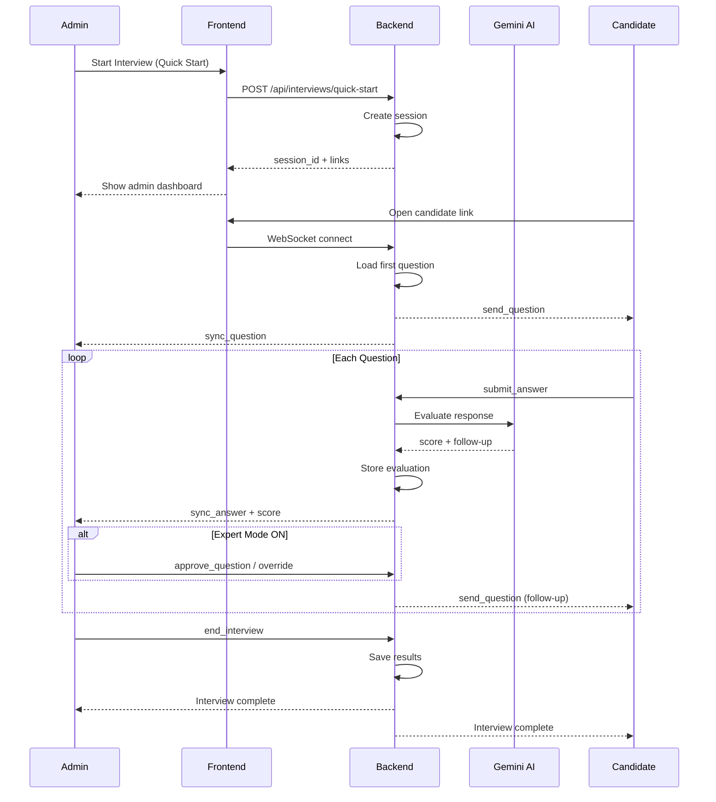
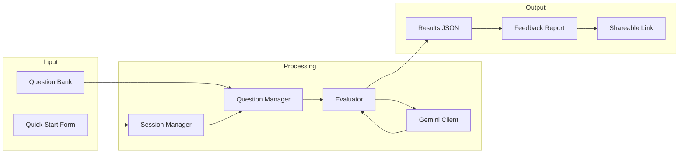
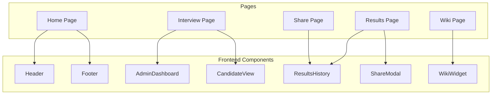

# AI Interview Platform - Architecture Diagrams

This folder contains architecture diagrams for the AI Interview Platform.

## Diagrams

### System Overview

### Interview Flow Sequence

### Data Flow

### Component Architecture

## File Locations

| Diagram | Description |
|---------|-------------|
| System Overview | High-level component architecture |
| Interview Flow | Step-by-step sequence diagram |
| Data Flow | How data moves through the system |
| Component Architecture | Frontend component hierarchy |

## Rendering

These diagrams use [Mermaid](https://mermaid.js.org/) syntax and can be rendered:
- In GitHub/GitLab README files
- In VS Code with Mermaid extension
- On the Wiki page (planned feature)
- At [mermaid.live](https://mermaid.live/)
