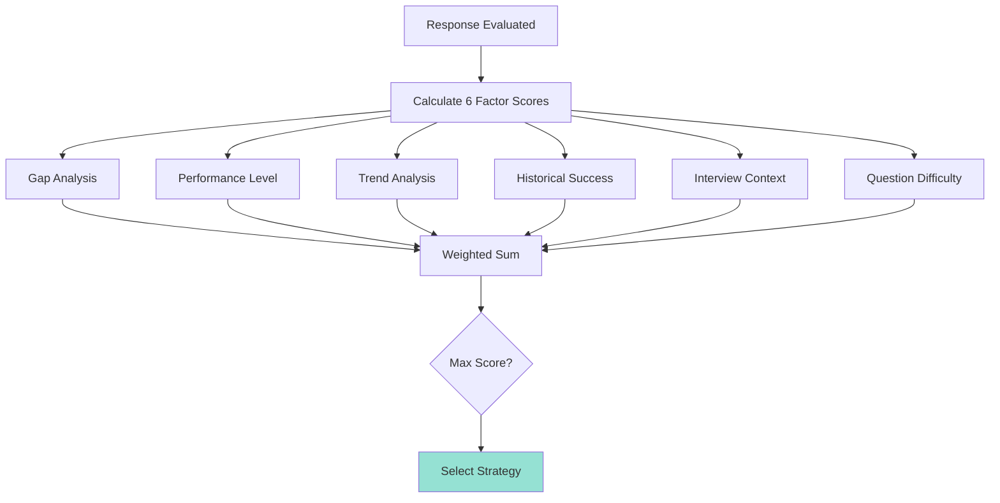

# Multi-Factor Strategy Selection System

## Core Concept: Weighted Scoring Across Multiple Dimensions

Instead of sequential if-else checks, each strategy gets a **composite score** based on 6 key factors:



---

## The 6 Scoring Factors

### 1. Gap Analysis (40% weight)
**What gaps exist in the response?**

```python
gaps = {
    "completeness_gap": max(0, 60 - completeness),  # How incomplete?
    "depth_gap": max(0, 50 - depth),                # How shallow?
    "technical_gap": max(0, 70 - technical_accuracy),
    "clarity_gap": max(0, 60 - clarity)
}

# Strategy scores based on gaps
clarification_score = gaps["completeness_gap"] * 2 + gaps["clarity_gap"]
depth_score = gaps["depth_gap"] * 2 + gaps["technical_gap"]
```

**Example**: Completeness=49, Depth=49
- `completeness_gap = 11` → Clarification gets 22 points
- `depth_gap = 1` → Depth gets 2 points
- **Clarification wins** (addresses bigger gap)

### 2. Performance Level (25% weight)
**How well is the candidate doing overall?**

```python
if overall_score >= 80:
    challenge_score += 50  # Push harder
elif overall_score >= 60:
    breadth_score += 30    # Explore related topics
elif overall_score < 40:
    clarification_score += 40  # Simplify and clarify
```

### 3. Trend Analysis (15% weight)
**Is the candidate improving or declining?**

```python
trend = calculate_trend(last_3_scores)

if trend == "improving":
    challenge_score += 20  # Ride the momentum
elif trend == "declining":
    clarification_score += 25  # Provide support
    depth_score -= 10  # Don't dig deeper when struggling
```

### 4. Historical Success (10% weight)
**Which strategies have worked well for this candidate?**

```python
for strategy_id, history in strategy_context.items():
    if history["avg_improvement"] > 10:
        scores[strategy_id] += 15  # Boost successful strategies
    elif history["avg_improvement"] < -5:
        scores[strategy_id] -= 10  # Penalize failing strategies
```

### 5. Interview Context (5% weight)
**Where are we in the interview?**

```python
progress = current_question / total_questions

if progress < 0.3:  # Early interview
    breadth_score += 10  # Explore broadly
elif progress > 0.7:  # Late interview
    challenge_score += 10  # Final push
```

### 6. Question Difficulty (5% weight)
**How hard was the question?**

```python
if question_difficulty == "hard" and overall_score > 60:
    challenge_score += 15  # They handled hard well
elif question_difficulty == "easy" and overall_score < 50:
    clarification_score += 20  # Struggling on easy questions
```

---

## Complete Scoring Example

**Scenario**: Completeness=49, Depth=49, Overall=55, Improving trend

```python
# 1. Gap Analysis (40% weight)
clarification_score = (60-49)*2 + 0 = 22
depth_score = (50-49)*2 + 0 = 2
challenge_score = 0
breadth_score = 0

# 2. Performance Level (25% weight)
# Score=55 → breadth territory
breadth_score += 30

# 3. Trend Analysis (15% weight)
# Improving → boost challenge
challenge_score += 20

# 4. Historical Success (10% weight)
# Assume clarification worked well before
clarification_score += 15

# 5. Interview Context (5% weight)
# Mid-interview (50% progress)
# No bonus

# 6. Question Difficulty (5% weight)
# Medium difficulty, medium score
# No bonus

# FINAL SCORES:
clarification: 37 points
depth: 2 points
breadth: 30 points
challenge: 20 points

→ CLARIFICATION WINS (addresses biggest gap + historical success)
```

---

## How This Handles Followups Better

### Scenario 1: Both Metrics Low (Completeness=49, Depth=49)
**Current System**: Always picks Clarification (ignores depth)
**New System**: 
- Calculates gaps for both
- Picks strategy addressing **larger gap**
- If gaps are equal, considers other factors (trend, history)

### Scenario 2: Improving Candidate (Score trend: 40→55→68)
**Current System**: Picks based only on current score (68 → Breadth)
**New System**:
- Recognizes **improving trend**
- Boosts Challenge strategy
- Result: **Challenge** (ride the momentum, push harder)

### Scenario 3: Strategy Fatigue (Clarification used 3x, no improvement)
**Current System**: Keeps picking Clarification if completeness is low
**New System**:
- Tracks that Clarification hasn't helped
- **Penalizes** Clarification score
- Tries **different approach** (maybe Depth or Breadth)

### Scenario 4: Late Interview Excellence (Q4/4, Score=85)
**Current System**: Challenge strategy
**New System**:
- Challenge gets base score for high performance
- **Extra boost** for late interview (final assessment)
- Result: **Stronger Challenge** with harder questions

---

## Implementation Approach

### Phase 1: Core Scoring Engine
```python
def calculate_strategy_scores(evaluation, context):
    scores = {
        "clarification": 0,
        "depth_focused": 0,
        "challenge": 0,
        "breadth_focused": 0
    }
    
    # Factor 1: Gap Analysis (40%)
    scores = add_gap_scores(scores, evaluation)
    
    # Factor 2: Performance Level (25%)
    scores = add_performance_scores(scores, evaluation)
    
    # Factor 3: Trend Analysis (15%)
    scores = add_trend_scores(scores, context)
    
    # Factor 4: Historical Success (10%)
    scores = add_history_scores(scores, context)
    
    # Factor 5: Interview Context (5%)
    scores = add_context_scores(scores, context)
    
    # Factor 6: Question Difficulty (5%)
    scores = add_difficulty_scores(scores, evaluation, context)
    
    return scores

def select_strategy_v2(evaluation, context):
    scores = calculate_strategy_scores(evaluation, context)
    selected_id = max(scores, key=scores.get)
    
    # Log decision reasoning
    log_strategy_decision(selected_id, scores, evaluation, context)
    
    return create_strategy(selected_id)
```

### Phase 2: Learning & Adaptation
- Track strategy performance over time
- Adjust weights based on outcomes
- Build candidate-specific patterns

---

## Expected Improvements

| Scenario | Current Behavior | New Behavior | Benefit |
|----------|-----------------|--------------|---------|
| Multiple low metrics | Picks first in priority | Addresses biggest gap | Better targeted followups |
| Improving candidate | Static strategy | Rides momentum | Faster skill assessment |
| Strategy not working | Keeps trying same | Switches approach | Avoids dead ends |
| Late interview | Same as early | Final push | Comprehensive assessment |
| Historical patterns | Ignored | Leveraged | Personalized experience |

---

## Next Steps

1. Implement core scoring engine
2. Add logging for decision transparency
3. Test with edge cases (both metrics low, etc.)
4. Track performance metrics
5. Iterate based on results

**Key Question**: Should we start with all 6 factors or begin with the top 3 (gaps, performance, trend)?
